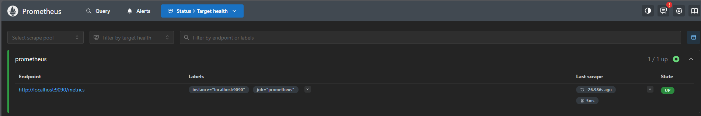
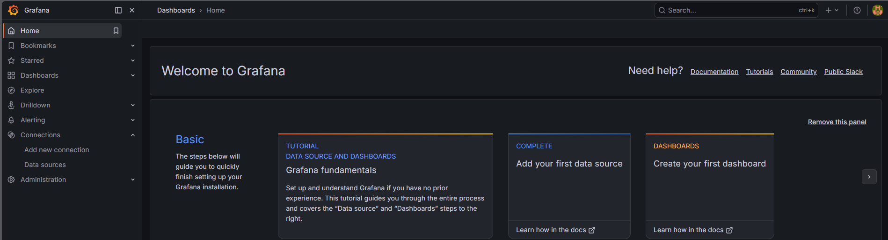
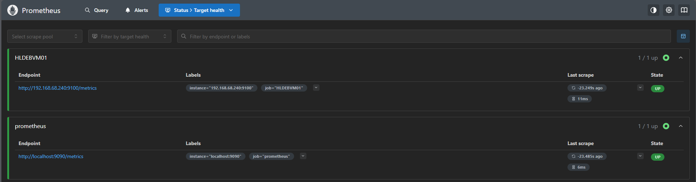
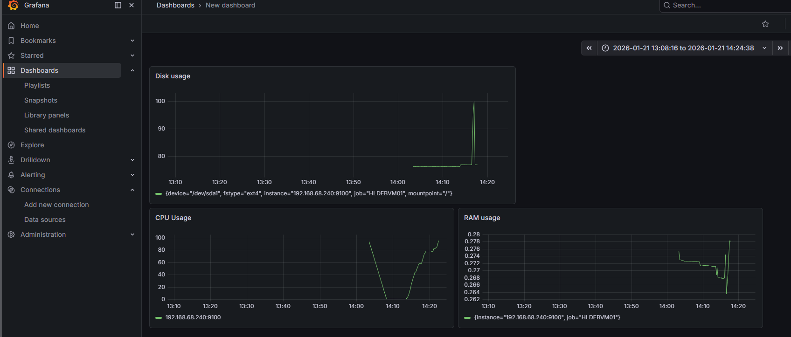

# Task 1: Basic Prometheus + Grafana Setup with Docker Compose [v]

## Goal
Set up a simple monitoring stack using **Prometheus** and **Grafana** running in Docker containers.  
The purpose of this project is to:
- Learn how to deploy and configure Prometheus and Grafana
- Understand basic Prometheus configuration (scrape targets, scrape intervals)
- Create a first simple dashboard in Grafana
- Get familiar with Docker Compose for multi-container applications

### Solution:

1. Create docker file with Prometheus:
```yaml
services:
  prometheus:
    container_name: prometheus_ct
    image: prom/prometheus:main
    volumes:
      - prometheus_data:/prometheus
      - ./prometheus.yml:/etc/prometheus/prometheus.yml
    ports:
      - 9090:9090
    restart: unless-stopped
volumes:
  prometheus_data:
```

2. Create simple Prometheus config file:
```yaml
global:
  scrape_interval: 5s #scrape metrics from targets every 5 seconds

scrape_configs:
- job_name: "prometheus"
  static_configs:
  - targets:
    - localhost:9090  #scrape Prometheus on http://localhost:9090/metrics
```

3. Add Grafana to `docker-compose.yml`:
```yaml
  grafana:
    container_name: grafana_ct
    image: grafana/grafana:main
    ports:
      - 3000:3000
    volumes:
      - grafana_data:/var/lib/grafana
    restart: unless-stopped
volumes:
  grafana_data:
```

4. Run docker compose:
```bash
docker compose up
```

5. Verify that Prometheus with Grafana are up and running properly:

-`http://localhost:9090` -> **Prometheus**



-`http://localhost:3000` -> **Grafana**




# Task 2: Adding Node Exporter – System-Level Monitoring [v]

## Goal
Extend the basic Prometheus + Grafana monitoring stack by adding **Node Exporter** to collect hardware and OS-level metrics (CPU, memory, disk, network, load average, etc.).  
The purpose of this project is to:
- Learn how to deploy and run Node Exporter (binary or Docker)
- Configure Prometheus to scrape metrics from a new target
- Use pre-built Grafana dashboards for quick visualization
- Simulate system load and observe real-time metric changes
- Understand the concept of exporters in the Prometheus ecosystem

### Solution:

1. Install node exporter on `HLDEBVM01`:

```bash
wget https://github.com/prometheus/node_exporter/releases/download/v1.8.2/node_exporter-1.8.2.linux-amd64.tar.gz
tar xvfz node_exporter-*.tar.gz
sudo mv node_exporter-*/node_exporter /usr/local/bin/
```

2. Create service on `HLDEBVM01`:
```bash
[Unit]
Description=Prometheus Node Exporter
Wants=network-online.target
After=network-online.target

[Service]
User=node_exporter
Type=simple
ExecStart=/usr/local/bin/node_exporter \
  --web.listen-address=:9100
Restart=always
RestartSec=10

[Install]
WantedBy=multi-user.target
```

3. Start the service:
```bash
sudo systemctl daemon-reload
sudo systemctl enable node-exporter  
sudo systemctl start node-exporter
```

4. Add scrape from new VM `prometheus.yml`:
```yml
- job_name: "HLDEBVM01"
  static_configs:
  - targets:
    - 192.168.68.240:9100
```

5. Check if the new vm is visible on Prometheus:



6. Create dashboard in Grafana and run some stress tests to check the metrics:

